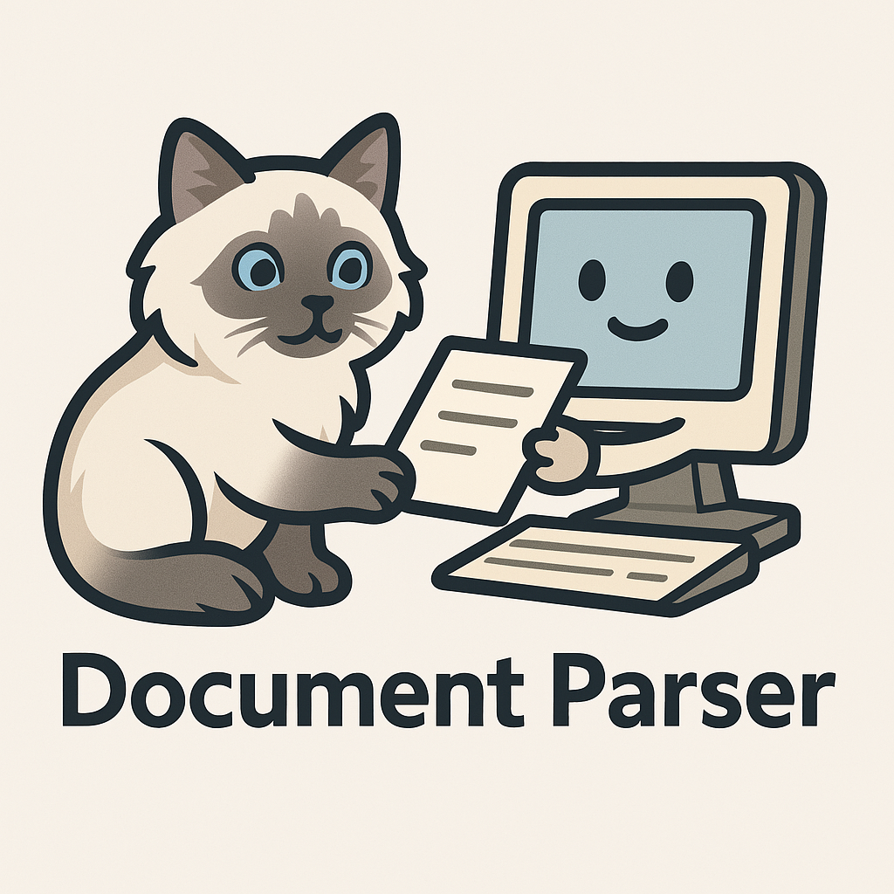

# Document Parser

<p align="center">
  
</p>

<p align="center">
  <a href="#개요">개요</a> •
  <a href="#기능">기능</a> •
  <a href="#설치-방법">설치 방법</a> •
  <a href="#사용-방법">사용 방법</a> •
  <a href="#문제-해결">문제 해결</a> •
  <a href="#라이센스">라이센스</a>
</p>

## 개요

Document Parser는 Upstage API를 사용하여 문서 파일(PDF, Word, Excel 등)을 파싱하고 구조화된 데이터를 JSON 형태로 추출하는 도구입니다. macOS 환경에서 네이티브 파일 선택 대화상자를 통해 편리하게 파일을 선택할 수 있습니다.

## 기능

- 다양한 문서 포맷(PDF, DOCX, XLSX 등) 지원
- macOS 네이티브 파일 선택 대화상자
- 커맨드라인 인터페이스 지원
- 파싱 결과를 JSON으로 자동 저장
- .env 파일을 통한 API 키 관리

## 설치 방법

### 사전 요구사항

- Python 3.8 이상
- Upstage API 키 (https://upstage.ai 에서 발급)

### 1. 저장소 클론

```bash
git clone https://github.com/saisiot/DocuParser.git
cd DocuParser
```

### 2. 가상 환경 설정 (권장)

```bash
python -m venv .venv
source .venv/bin/activate  # macOS/Linux
# 또는
# .venv\Scripts\activate   # Windows
```

### 3. 필요한 패키지 설치

```bash
pip install -r requirements.txt
```

requirements.txt 파일이 없는 경우 다음 명령으로 필요한 패키지를 설치하세요:

```bash
pip install requests python-dotenv
```

### 4. .env 파일 설정

프로젝트 루트 디렉토리에 `.env` 파일을 생성하고 다음과 같이 Upstage API 키를 설정하세요:

```
UPSTAGE_API_KEY=your_api_key_here
```

## 사용 방법

### 명령줄에서 실행하기

파일 경로를 직접 지정하여 실행:

```bash
python document_parser.py -f "파일경로.pdf"
```

파일 선택 대화상자를 통해 실행:

```bash
python document_parser.py
```

### 작동 방식

1. 프로그램 실행 시 `.env` 파일에서 API 키를 자동으로 로드합니다.
2. API 키가 없는 경우 명령줄에서 입력하라는 메시지가 표시됩니다.
3. 명령줄 인수로 파일을 지정하지 않은 경우, macOS 파일 선택 대화상자가 열립니다.
4. 문서를 선택하면 Upstage API를 통해 문서가 파싱됩니다.
5. 파싱된 결과는 자동 생성된 `output` 폴더에 JSON 파일로 저장됩니다.

### API 매개변수 설명

현재 다음 API 매개변수를 사용합니다:

| 매개변수 | 값 | 설명 |
|---------|-----|------|
| ocr | "force" | OCR 처리를 강제로 실행합니다 |
| base64_encoding | "['table']" | 테이블 데이터를 Base64로 인코딩합니다 |
| model | "document-parse" | 문서 파싱에 사용할 모델을 지정합니다 |

이 매개변수는 필요에 따라 `parse_document_upstage` 함수에서 수정할 수 있습니다.

## 문제 해결

### API 오류

404 오류가 발생하는 경우:
- API 엔드포인트 URL이 올바른지 확인하세요 (`https://api.upstage.ai/v1/document-digitization`)
- API 키가 유효한지 확인하세요
- Upstage 계정의 API 사용 권한을 확인하세요

### 파일 접근 오류

파일을 열 수 없는 경우:
- 파일 경로가 올바른지 확인하세요
- 파일에 접근 권한이 있는지 확인하세요
- 지원되는 파일 형식인지 확인하세요 (PDF, DOCX, XLSX 등)

## 라이센스

MIT

---

<p align="center">
  Made with ❤️ by saisiot
</p>